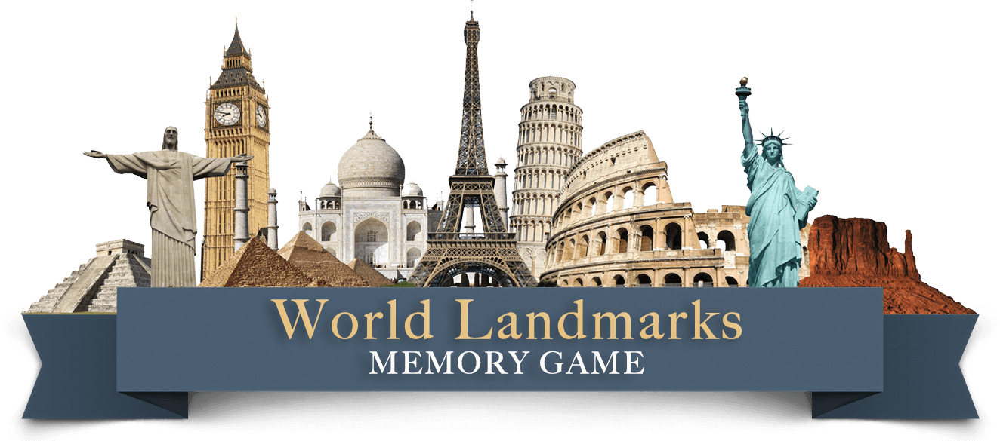

  


This memory game is designed to honor some of the best world's landmarks while being a challenging and entertaining game.
There is no age restriction for this game, but it will be more enjoyable by children over 8 years and adults.

[Play the World Landmarks Memory Game here](https://rodrigoneumann.github.io/Second-Milestone-Project/)


***

## Table of Contents
1. [**UX**](#ux)
    - [**Project Goals**](#project-goals)
    - [**Design**](#design)
    - [**Wireframes**](#wireframes)

2. [**Features**](#features)
    - [**Main Page**](#main-page)
    - [**Game Page**](#game-page)
    - [**Result Page**](#result-page)

3. [**Technologies used**](#technologies-used)

4. [**Testing**](#testing)

5. [**Deployment**](#deployment)

6. [**Credits**](#credits)
    - [**Content**](#content)
    - [**Media**](#media)
    - [**Code**](#code)
    - [**Acknowledgements**](#acknowledgements)


## UX

#### Project Goals

This game has 3 main purposes:<n>
The first is to test the player's memorability.
The second is to test and the speed of matching all cards by surpassing their own time record.
The third is to let the player learn in which country each landmark is located, by repetition and visualization.

#### Design


This project was developed focusing on a mobile-first approach. However with complete responsiveness on other screen sizes.
Because of the number of cards and the need to view them all at the same time for a better and easier experience, the best mobile gaming mode is portrait mode.
On devices with larger screens, such as tablets or laptops, this difference is hardly felt in the user experience, and it is possible to play in either portrait or landscape mode.

**Font**

- The main font used in this project is **Robotto**. I think that's a well designed and easy to read font. Used in menu titles, instructions content, box numbers, and Results page.
- The fonts used in the cards are **Zapfino** for the landmark name and **Robotto** for the country name.
- The font used in the game Banner and  is 
**Big Caslon**

**Colours**

- The colors used in the menus are a darker yellow tone with high opacity allowing the background colors to still be seen but blurry.
- The buttons have a dark tone with white letters and black borders, making an interesting effect.
- The colors on the logo were chosen to contrast with the yellow-gold background.
In the first line of the name of the game a color was used very close to the background color and in the second line the white was used causing a good contrast with the blue of the banner.
- On the cards were used the logo blue with texture and an illustration with the landmarks around the globe. This blue makes an interesting contrast with the yellow-gold background texture. 

**Logo**

- In the logo was used an illustration with several landmarks side by side. Just below was placed a banner in blue without texture.
Inside this banner is the name of the game, wherein the first line with larger letters was written World Landmarks in larger letters and MEMORY GAME in smaller letters but all written in capital letters.
A larger shadow effect was placed on the first line to cause a more pronounced feel, while on the lower line with less shadow effect.

**Cards**

- All cards were designed in Photoshop using images from each landmark and a **Polaroid** photo model design which leaves a space at the bottom to add the information of each landmark card.

**Styling**

- All cards and container boxes have rounded corners for a better look and style.
- Level selection, Play game, try again and main menu buttons have Bootstrap 4 button color style - BTN Dark and Dark outline. 

**Background**

- The background image was created in Photoshop and has a gold-yellow texture and shadows of the landmarks in the background with very low opacity so that it doesn't catch the attention of other items on the screen.  

#### Wireframes
These wireframes were designed with Balsamiq 3 tool. That was the first version of scope and some minor things have changed during the development for the final version.
* Mobile version [here](https://raw.githubusercontent.com/rodrigoneumann/Second-Millestone-Project/master/wireframes/mobile_display.png)
* Medium displays [here](https://raw.githubusercontent.com/rodrigoneumann/Second-Millestone-Project/master/wireframes/tablet_display.png)
* Large displays [here](https://raw.githubusercontent.com/rodrigoneumann/Second-Millestone-Project/master/wireframes/large_display.png)

## Features

#### Main Page

**Difficulty Level Selection**
   - On the main page, there is the difficulty selection mode. There are 3 levels for the player to choose, easy, normal and hard. 
   - If the player chooses no difficulty level, the easy level will be set by default. 
  **Easy Mode**
  In easy mode, the player will have 8 seconds to memorize all card positions before the game starts.
  Once the game starts the player will have 45 seconds to try to match all pairs of cards in the game.
  **Normal Mode**
  In normal mode, the player will have 5 seconds to memorize all card positions and 30 seconds to try to match all pairs of cards in the game.
  **Hard Mode**
  and in hard mode, the player will have 3 seconds to memorize all card positions and 25 seconds to try to match all pairs of cards in the game.

**Game Instructions**
   - Each time a game mode is selected, the game instructions will be updated and the instructions for that selected difficulty mode will be displayed.

**Play Game button**
  - After the difficulty mode is selected, the player will have to click the PLAY GAME button to first display the MEMORIZE screen with all 12 cards face up with the countdown.
  Right after the countdown is over, all cards are dealt face down and the game begins. 

### Game Page

  **Attempts counter**
  - Located above the game board at the top of the page, the attempts counter counts the number of attempts the player has taken in the current game. 
  - Each attempt, right or wrong, will be counted and will set your final score.

  **Time countdown**
  - Located to the right of the attempt counter, the timer countdown receives the difficulty selected by the player on the main page and determines how long the game will take, can be 45, 30 or 20 seconds.

  **Main page button**
  - Located between the attempt counter and the timer countdown, this house icon 
  stop the game and return the player to the main page.

  **Game board**
  - The game board consists of 12 cards.
  - On mobile display, it is organized in 3 columns of 4 cards each and
  - On larger screens, it is organized in 4 columns of 3 cards each.
  - On the game board, only one card is allowed to turn at a time and after the second card dealt, the deck is blocked to prevent the player from being able to flip other cards.
  - After checking that the two cards are the same, the cards remain turned and locked for further clicks.
  - If the two cards are different, they are dealt face down again and released for further attempts.
  - After all cards match the game is over and the result screen is displayed after 2 seconds.
  - If time runs out before all cards match, the game over screen is displayed.

### Result Page

**Emoticon**
- When the result page is displayed, if the player wins the match a smiley emoticon will be displayed. In case the player has lost the game a sad face emoticon will be displayed.

**Result message**
- When the result page is displayed,
 and the player has won the match with the fastest time compared to previous attempts, the NEW RECORD message will be displayed.
- If the player was the winner but was not the fastest time compared to previous attempts, the message WELL DONE will be displayed.
- If time is up and the player has lost the game, the message YOUR TIME IS UP will be displayed.

**Attempt Counter**
- After the player wins the game, the attempt counter on the result screen will display how many attempts the player has tried to match all the cards.

**Time Counter result**
- After the player wins the game, the team counter will display how many seconds it has taken the player to match all cards.

**Try again button**
- Located just below the result boxes, this button starts the game again with the same difficulty level selection as the last game. It starts directly on the memorize page.

**Main page button**
- Located just below the TRY AGAIN button, this button clear the last difficult level selection and set it to easy as default and return the player to the main page.

### Features Left to Implement

In the future I would like to add on this project:

#### New functions and menus

**New landmarks**
- The idea is to gradually increase the number of landmarks to approximately 30. Thus, each game will be randomly chosen the 6 that will be available for that game. This will make the game more attractive and interesting to players.

**LeaderBoard**
- Implement a database so I can create and manage a leaderboard.

**Sound**
- Add sounds to clicks and buttons to make the game more fun.

#### Mobile version
- A further idea is to create a mobile version that runs natively on Android and IOS.


## Technologies Used

- This project uses HTML5, CSS3 and JavaScript ES6 as the basis of its structure and development.
- [JQuery](https://jquery.com)
    - The project uses **JQuery** to simplify DOM manipulation.
- [Visual Studio Code](https://code.visualstudio.com/) 
    - Development used **VS Code** IDE while building the website, for a better experience and organization.
- [Bootstrap 4.3.1](https://www.bootstrapcdn.com/)
    - This project uses **Bootstrap** for better responsiveness and organization. It was also used for some CSS attributes and effects.
- [FontAwesome 5.11.2](https://cdnjs.cloudflare.com/ajax/libs/font-awesome/5.11.2/css/all.css)
    - The project uses **Font Awesome** to provide some icons. 
- [Google Fonts](https://fonts.google.com/)
    - The project uses **Google fonts** to provide 'Roboto' font.
- [Dev Tools](https://www.google.com/chrome/)
    - This project used the Dev Tools from 3 browsers: Chrome, Firefox and Safari. They were necessary to keep track and test the code and development.
- [GitHub](https://github.com/)
    - This project uses **GitHub** to store and share all project code remotely. 
    - **GitHub Pages** is used to hosting the project live demo.
- [Photoshop CC 2019](http://www.adobe.com/Photoshop)
    - This project used **Photoshop CC** to edit all the images.
- [AutoPrefixer](https://autoprefixer.github.io/)
    - The project used *AutoPrefixer** to make sure all CSS prefixes were up to date. 

## Testing

#### Tools used for testing

- HTML

  - [The W3C Markup Validation Service](https://validator.w3.org/)

- CSS

  - [The W3C Markup Validation Service](https://jigsaw.w3.org/css-validator)

- JavaScript

  - [JS Hint](https://jshint.com/)

* This project was tested across multiple browsers (Chrome, Opera, Safari, Firefox, and IE) in different simulated and real devices.

- Phones

  - Galaxy Note 8
  - Galaxy Note 9
  - Galaxy S5
  - Galaxy S7+ (real device)
  - Galaxy S9/S9+ (real device)
  - iPhone 5/SE
  - iPhone 6/7/8
  - iPhone 8 Plus (real device)
  - iPhone X (real device)
  - iPhone XR (real device)
  - iphone XS 
  - iphone XS Max (real device)
  - LG Optimus L70
  - Microsoft Lumia 550
  - Microsoft Lumia 950
  - Nexus 5X
  - Nexus 6P
  - Nokia 8110 4G
  - Pixel 2
  - Pixel 2 XL

- Tablets
  - iPad (real device)
  - iPad Pro (10.5-inch)
  - iPad Pro (12.9-inch)
  - Kindle Fire HDX
  - Nexus 10
  - Nexus 7

* Laptops

  - MacBook Pro 13" (real device)
  - Asus Swift 3 (real device)

* Windows 10 computer
  - Philips 1080p Full HD (real device)
 
**Were found some display issues with discontinued browsers such as IE and obsolete versions of Chrome and Opera.
Especially regarding the new CSS effects features**

## Deployment
This project was developed using the Visual Studio Code. The version control system [Git](https://git-scm.com) was used to commit and track all changes. The hosting platform [GitHub](https://github.com/) was used to store the repository, and to deploy the project on [GitHub Pages](https://pages.github.com/) for a live demo.

#### The World Landmarks Memory Game was deployed to GitHub Pages according to these instructions:
1. Log into GitHub
2. From the repository list on the sidebar to the left, select **rodrigoneumann/Second-Milestone-Project**.
3. From the menu under the repository name, select **Settings**.
4. Scroll down to the **GitHub Pages** section.
5. Under the **Source** heading click the drop-down menu and from the list select **Master Branch**.
6. [World Landmarks Memory Game](https://rodrigoneumann.github.io/Second-Milestone-Project/) is now **deployed** on GitHub Pages.
7. Return to the **Github Pages** section in the **Settings** tab to retrieve the link to the [deployed site](https://rodrigoneumann.github.io/Second-Milestone-Project/).

### To run the project locally, follow the instructions below:

1. Follow this link to the [World Landmarks Memory Game GitHub repository](https://github.com/rodrigoneumann/Second-Milestone-Project).
2. Under the repository name, click "Clone or download".
3. In the Clone with HTTPs section, copy the clone URL for the repository. 
4. In your local IDE open Git Bash.
5. Change the current working directory to the location where you want the cloned directory to be made.
6. Type ```git clone```, and then paste the URL you copied in Step 3.
```console
git clone https://github.com/rodrigoneumann/Second-Milestone-Project.git
```
7. Press Enter. Your local clone will be created.

Your local clone is now created. If you would like further documentation on cloning a repository, you can read [Cloning a repository](https://help.github.com/en/articles/cloning-a-repository)

##Credits

### Content

- All text in this project was written by the developer.

### Media

#### Images
- The Landmarks images used on game cards were sourced from [Pixabay](http://www.pixabay.com) and [Unsplash](http://www.unsplash.com).
- The game Logo and card logo images were sourced from [Hiclipart](http://www.hiclipart.com).
- The Blue ribbon in the main game logo was sourced from [Pixeden](http://www.pixeden.com)
- The blue texture background used in cards  and the yellow-gold texture used like website background was sourced by [Freepik](http://freepik.com)
- The landmarks image used to background image was sourced from [Hiclipart](http://www.hiclipart.com).

### Code
- Code for flip Card animation and some functionalities like match cards, resettable, flip and unflip cards, disable and shuffle cards was learned, based and adapted from this video on [FreecodeCamp](https://www.youtube.com/watch?v=ZniVgo8U7ek)
- The code for adding the correct prefixes to CSS was created using [AutoPrefixer](https://autoprefixer.github.io/).

### Acknowledgements
Very Special Thanks to:
- My mentor in Code Institute Sandeep Aggarwal who had all the patience to explain and make me understand certain concepts and peculiarities of the javascript language.
- All 76 people, including family, friends, and colleagues who have tested the game on their real devices, reporting to me about any usability issues and giving improvement tips to improve the gaming experience.
- To all of the Code Institute Slack community for the help in my issues and review to my project code.

#### This project is designed for educational purposes only.